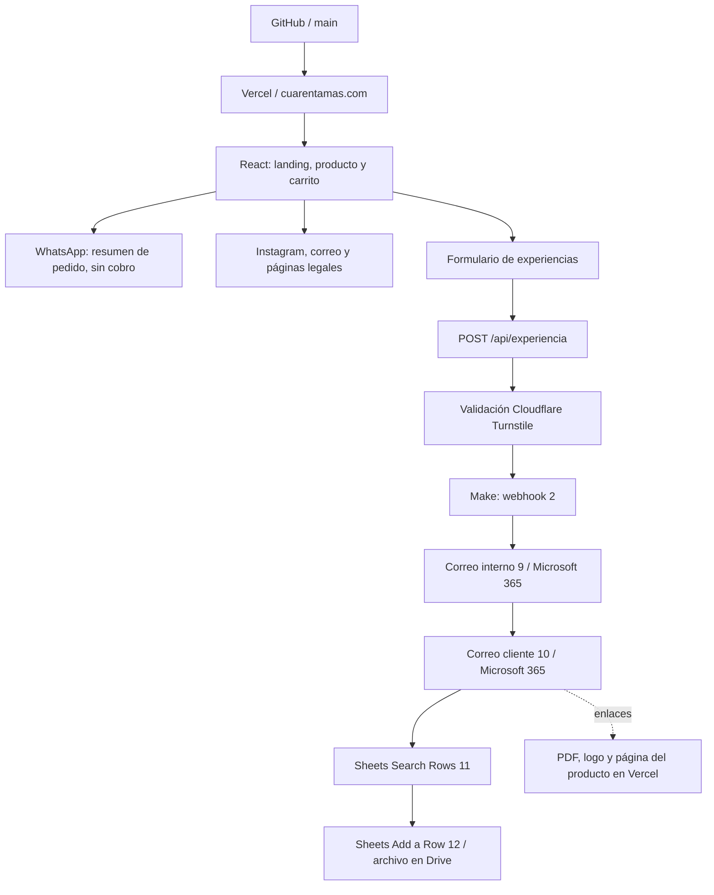

<p align="center"></p>

# cuarentamas — Commerce & Automation Engineering

[English](README.md) · **Español**

**Caso de estudio de AI Solution Engineering: de una web con carrito integrado a Tiendanube a una experiencia rediseñada con ventas por WhatsApp y automatización de clientes.**

[Sitio en producción](https://cuarentamas.com/) · [Producto](https://cuarentamas.com/producto/colageno-hidrolizado-40) · [Formulario](https://cuarentamas.com/comparte-tu-experiencia) · [Historia](docs/HISTORIA.md) · [Evidencia](docs/VERIFICACION.md)

Proyecto desarrollado por **Diego Franco** para **cuarentamas / 40+**, marca de ZENTIA HEALTHCARE GROUP S.A.S. Integra experiencia de usuario, frontend, APIs, automatización low-code, correo de dominio, distribución de contenido y despliegue. La marca se escribe **cuarentamas** o **40+**.

## La solución en una mirada

Una persona puede conocer el Colágeno Hidrolizado 40+, preparar un pedido para continuar por WhatsApp o compartir su experiencia para recibir el e-book Ritual 40+. El formulario valida la solicitud en el servidor y la entrega a Make. El escenario envía un aviso interno, responde al cliente y registra la información en Google Sheets, almacenado en Drive.

**Corte documentado: 2 de septiembre de 2026, America/Bogota.** Sitio publicado; escenario de Make activo; correo y botones aprobados por el responsable de la marca; DKIM habilitado. El flujo funciona en las pruebas registradas, pero aún tiene mejoras pendientes de deduplicación, estados y recuperación de errores. No se presenta como un sistema transaccional de entrega exactamente una vez.

## La historia del proyecto

**Primera etapa — web y carrito conectados a Tiendanube.** Se construyó la página comercial con un carrito integrado a Tiendanube para crear órdenes preliminares y continuar al checkout de la plataforma.

**Segunda etapa — rediseño y ventas por WhatsApp.** Después se rediseñó la experiencia de marca y se adaptó el carrito para preparar el pedido y continuar la venta por WhatsApp. La decisión respondió a las prioridades del negocio: reducir la inversión necesaria y facilitar la operación diaria y la atención directa al cliente.

El cambio priorizó una solución más adecuada para esa etapa del negocio, conservando el código histórico de Tiendanube como trazabilidad. A cambio, el pago y la confirmación del pedido se gestionan fuera de la web, con intervención humana. La motivación económica fue confirmada por el responsable del proyecto; no se publican cifras de ahorro ni comparaciones de tarifas que no hayan sido medidas.

**Tercera etapa — conectar la experiencia de marca con la operación.** La evolución no terminó en el carrito: se incorporó un formulario para que las personas compartieran su experiencia y recibieran el e-book Ritual 40+. Este recorrido reemplazó al antiguo formulario opcional de membresía conectado a n8n. El backend valida la solicitud y la entrega a Make; los módulos intermedios de Excel se sustituyeron por Google Sheets, dentro de Drive. Microsoft 365 envía un correo al cliente con el e-book y otro al equipo con la información recibida.

**Cuarta etapa — hacer que lo publicado coincidiera con lo construido.** Las pruebas revelaron problemas concretos: un despliegue conectado al repositorio equivocado, enlaces que no llegaban al contenido esperado y un logo que no cargaba bien en el correo. Se corrigió la conexión de Vercel, se verificó la descarga del PDF y se publicó una ruta estable para el logo. También se ajustaron títulos y botones en móvil, se refinó el correo con aprobación del responsable y se habilitó DKIM para el dominio.

**Quinta etapa — verificar y dejar trazabilidad.** Se probó el formulario público, se observaron los dos correos y la escritura en Sheets, y el responsable confirmó que la marca y ambos botones funcionaban. El escenario quedó activo. Después se documentaron la arquitectura, el historial, las plantillas y una exportación saneada de Make. Esa revisión también reveló mejoras pendientes en deduplicación y recuperación: se conservaron como límites explícitos, no como capacidades terminadas.

El resultado es una solución comercial que evolucionó con las prioridades del negocio, combinando desarrollo web, automatización y operación. [Historia completa, commits y decisiones](docs/HISTORIA.md).

## El reto y el aporte de ingeniería

El reto no era únicamente rediseñar una landing: había que conectar la promesa comercial con el registro de datos, la entrega del contenido y la operación de la marca, manteniendo trazabilidad entre sistemas distintos.

| Competencia | Trabajo aplicado | Evidencia |
| --- | --- | --- |
| Diseño de soluciones | Separar presentación, validación, automatización y canales comerciales | [Arquitectura](docs/ARQUITECTURA.md) |
| Integración full-stack + low-code | Contrato JSON entre React, API, Make, Sheets y Microsoft 365 | [Contrato y escenario](docs/MAKE.md) |
| Ingeniería asistida por IA | Iteraciones de código, diagnóstico, documentación y pruebas con Codex, revisadas y aprobadas por el responsable | [Evolución y decisiones](docs/HISTORIA.md) |
| Operación y entrega | Corrección del despliegue, dominio, DKIM, enlaces y carga del logo en correo | [Publicación](docs/PUBLICACION.md), [correo](docs/DNS-CORREO.md) |
| Calidad y criterio técnico | Distinguir implementación, prueba observada y pendiente; no publicar secretos ni datos de clientes | [Verificación](docs/VERIFICACION.md) |

**Alcance de IA:** la IA asistió el proceso de ingeniería. El producto publicado no incluye un LLM, chatbot, RAG ni decisiones automáticas basadas en IA. Make ejecuta una automatización determinista. No se atribuyen al proyecto métricas comerciales o ahorros que no fueron medidos.

## Antes → ahora

| Área | Base histórica del repositorio | Estado actual |
| --- | --- | --- |
| Experiencia comercial | Landing, catálogo, carrito y experiencia Three.js | Diseño editorial, producto destacado clicable, recetas y navegación simplificada |
| Cierre del pedido | Web con carrito integrado a Tiendanube, órdenes preliminares y checkout | Carrito rediseñado hacia WhatsApp por inversión y facilidad operativa; sin cobro en la web |
| Captación | Formulario opcional de membresía y webhook n8n | Formulario de experiencias con consentimiento y e-book, conectado a Make |
| Registro | Configuración intermedia con módulos Microsoft Excel | Google Sheets en Drive, pestaña `Experiencias` |
| Comunicación | Integraciones dependientes de configuración externa | Dos correos mediante Microsoft 365 desde `contacto@cuarentamas.com` |
| Entrega digital | Sin este recorrido de e-book en el commit inicial | PDF público descargable y enlace directo al producto en el correo |
| Confianza y publicación | Configuración inicial de sitio y correo | Turnstile, validaciones, cabeceras, consentimiento de medición y DKIM habilitado |
| Trazabilidad | README inicial y planes de publicación | Código + historia + inventario + exportación saneada de Make + plantillas + pruebas y límites |

La base histórica está en [`d307c97`](https://github.com/diegofrancoe/cuarentamas-commerce/commit/d307c97); el corte funcional aprobado está en [`a068b60`](https://github.com/diegofrancoe/cuarentamas-commerce/commit/a068b60). Los ajustes realizados en SaaS no aparecen automáticamente como commits: se registran por separado en la documentación.

## Arquitectura operativa



El orden de Make corresponde al `flow` exportado, no a las posiciones visuales de los módulos en el lienzo. La búsqueda actual no implementa deduplicación por `submissionId`. [Detalle exacto y consecuencias](docs/MAKE.md).

## Qué incluye

- Landing responsive, navegación al producto desde el hero, recetas y modal de preparación.
- Ficha de producto con imágenes frontal/posterior, información nutricional, uso, advertencias y datos del fabricante.
- Carrito en memoria, cantidades, resumen, tarifas de envío y apertura de WhatsApp con datos del pedido. La persona debe enviar el mensaje; la web no confirma pago ni despacho.
- Formulario con campos obligatorios, consentimiento de datos, autorización testimonial separada, honeypot, tiempo mínimo y Turnstile verificado en servidor.
- Registro y envío de dos correos en Make: notificación interna y e-book para el cliente.
- Correo HTML aprobado: logo de 88 px, tipografía neutra y botones compactos. El PDF va **como enlace de descarga**, no como adjunto.
- SEO por ruta, metadatos sociales, sitemap, favicon y Meta Pixel `PageView` condicionado al consentimiento.
- Documentación de la integración histórica Tiendanube y del flujo n8n retirado, sin reactivarlos.

## Stack y límites del alcance

React 19 · React Router 7 · Vite 7 · CSS / Tailwind CSS 3 · Node.js · Express · Axios · Vercel Functions · Make · Google Sheets / Drive · Microsoft 365 Outlook · Cloudflare Turnstile · DNS GoDaddy.

Three.js permanece como dependencia heredada, pero la interfaz actual usa composición de imágenes y CSS: no hay un visor WebGL activo. No hay POS, inventario sincronizado, pagos online activos, WhatsApp Business API, CRM completo ni publicación automática de testimonios.

## Ejecutar localmente

Requisito: Node.js compatible con la versión fijada por `package-lock.json` (el paquete Vite instalado declara `^20.19.0 || >=22.12.0`) y npm.

```bash
npm ci
cp .env.example .env
npm run dev
```

En otra terminal:

```bash
npm run server
```

Vite atiende el frontend y redirige `/api` al servidor local en `localhost:4000`. Conservar `PORT=4000` o ajustar también el proxy. `npm run preview` sirve la compilación estática; no sustituye las funciones de Vercel ni el backend local.

El formulario necesita configuración privada para llegar a Make. **No conectar pruebas locales a un escenario productivo sin preparar sus destinatarios y efectos.** Las claves de desarrollo de Turnstile no son válidas para producción. [Configuración y operación](docs/PUBLICACION.md).

```bash
npm run lint
npm run build
node scripts/verify-project-docs.mjs
```

## Mapa del repositorio

```text
src/                     Interfaz, rutas, carrito, contenido y medición
api/                     Experiencias y adaptador Tiendanube deshabilitado
server/                  Backend local y verificación Turnstile compartida
public/downloads/        E-book Ritual 40+
public/email/            Logo estable para clientes de correo
docs/                    Arquitectura, decisiones, operación y evidencia
docs/automation/         Blueprint saneado, contrato, encabezados y emails
scripts/                 Verificación de coherencia documental
```

Los README y la historia completa están disponibles en inglés y español. Los demás documentos técnicos enlazados a continuación se conservan en español; las plantillas de correo al cliente no se traducen.

| Documento | Para qué sirve |
| --- | --- |
| [Historia y decisiones](docs/HISTORIA.md) | Antes, iteraciones, incidentes resueltos, Tiendanube y n8n |
| [Arquitectura](docs/ARQUITECTURA.md) | Fronteras, contrato y recorrido de los datos |
| [Inventario de integraciones](docs/INTEGRACIONES.md) | WhatsApp, redes, correo, Drive, Sheets, Make, DNS y hosting |
| [Make](docs/MAKE.md) | Configuración observada, mapeos, límites y restauración |
| [Publicación y mantenimiento](docs/PUBLICACION.md) | Entorno, Git, Vercel, operación y rollback |
| [Correo y DNS](docs/DNS-CORREO.md) | SPF, DKIM, DMARC y entrega |
| [Verificación](docs/VERIFICACION.md) | Qué se probó, cómo y qué no se debe afirmar todavía |

## Trazabilidad y uso como portafolio

La aplicación funcional aprobada ya estaba en `origin/main` mediante avance **fast-forward**, sin PR ni commit de merge separado. La [historia](docs/HISTORIA.md) explica esa diferencia; no se inventa una revisión por PR que no existió.

El repositorio sigue **privado**. Un enlace no da acceso a un reclutador sin permisos. Cambiarlo a público requiere una revisión separada de todo el historial, activos y derechos de distribución; no basta con revisar el último README. El código y los recursos de marca no incluyen una licencia de reutilización abierta.

El respaldo de Make excluye conexiones privadas, identificadores de webhook/hoja y datos de ejecución. No es infraestructura desplegada automáticamente por Git: cualquier cambio en Make, DNS, Drive o Microsoft 365 debe volver a documentarse y probarse. Esta entrega no agrega contraseñas, secretos, conversaciones ni testimonios de clientes.
