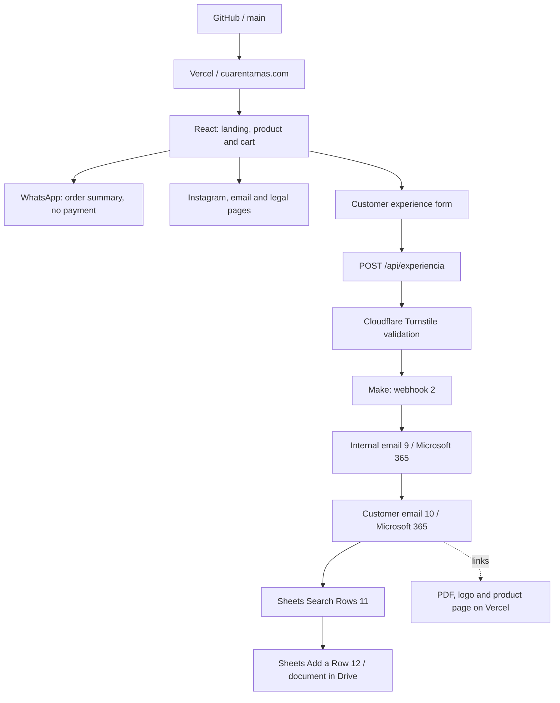

<p align="center"></p>

# cuarentamas — Commerce & Automation Engineering

**English** · [Español](README.es.md)

**An AI Solution Engineering case study: from a website with a Tiendanube-integrated shopping cart to a redesigned customer experience with WhatsApp-assisted sales and automated customer communications.**

[Live website](https://cuarentamas.com/) · [Product](https://cuarentamas.com/producto/colageno-hidrolizado-40) · [Experience form](https://cuarentamas.com/comparte-tu-experiencia) · [Project history](docs/HISTORIA.en.md) · [Verification record — ES](docs/VERIFICACION.md)

Developed by **Diego Franco** for **cuarentamas / 40+**, a brand of ZENTIA HEALTHCARE GROUP S.A.S. The project brings together user experience, frontend development, APIs, low-code automation, domain email, digital content delivery, and deployment. The brand is written as **cuarentamas** or **40+**.

## Solution at a glance

Visitors can discover Colágeno Hidrolizado 40+, prepare an order to continue through WhatsApp, or share their experience to receive the Ritual 40+ e-book. The form validates submissions on the server and passes them to Make. The scenario sends an internal notification, emails the customer, and records the information in a Google Sheets document stored in Drive.

**Documented baseline: September 2, 2026, America/Bogota.** The website is deployed, the Make scenario is active, the brand owner has approved the email and its buttons, and DKIM is enabled. The recorded tests demonstrate the working flow, while deduplication, delivery-state tracking, and error recovery still need improvement. This is not presented as an exactly-once transactional delivery system.

## The project story

**Stage 1 — a website and shopping cart integrated with Tiendanube.** The initial commercial website was built with a cart connected to Tiendanube to create draft orders and continue to the platform's checkout.

**Stage 2 — a redesign and a shift to WhatsApp-assisted sales.** The brand experience was then redesigned, and the cart was adapted to prepare an order and continue the sale through WhatsApp. This was a business-led decision: reduce the investment required and make day-to-day operations and direct customer support easier.

The change prioritized a solution that better fit the business at that stage, while preserving the Tiendanube integration's history in the repository. The trade-off is that payment and order confirmation happen outside the website, with human involvement. The project owner confirmed the cost and operational rationale; no unmeasured savings or pricing comparisons are claimed.

**Stage 3 — connecting the customer experience to business operations.** The evolution went beyond the cart. An experience-sharing form was introduced so customers could tell their story and receive the Ritual 40+ e-book. This replaced the earlier optional membership form connected to n8n. The backend validates the submission and hands it to Make; intermediate Excel modules were replaced with Google Sheets in Drive. Microsoft 365 sends the customer an email with the e-book link and the team a separate notification containing the submitted information.

**Stage 4 — making the deployed experience match the intended solution.** Testing exposed concrete issues: deployment was linked to the wrong repository, links did not reach the expected content, and the logo did not load reliably in email. The Vercel connection was corrected, the PDF download was verified, and a stable email-logo URL was published. Mobile headings and buttons were refined, the email was iterated with the owner's approval, and DKIM was enabled for the domain.

**Stage 5 — verifying the result and preserving its history.** The public form was tested, both emails and the Sheets write were observed, and the owner confirmed that the branding and both buttons worked. The scenario was activated. Architecture, history, email templates, and a sanitized Make export were then documented. That review also revealed unfinished deduplication and recovery controls, which were recorded as explicit limitations rather than completed capabilities.

The result is a commercial solution that evolved with business priorities, combining web development, automation, and operations. [Read the full history, commits, and decisions](docs/HISTORIA.en.md).

## The challenge and engineering contribution

The challenge was not just to redesign a landing page. It was to connect the customer-facing promise with data capture, content delivery, and the brand's operations, while keeping decisions traceable across separate systems.

| Competency | Applied work | Evidence |
| --- | --- | --- |
| Solution design | Separate presentation, validation, automation, and sales channels | [Architecture — ES](docs/ARQUITECTURA.md) |
| Full-stack + low-code integration | Define the JSON contract across React, the API, Make, Sheets, and Microsoft 365 | [Contract and scenario — ES](docs/MAKE.md) |
| AI-assisted engineering | Iterate on code, diagnosis, documentation, and testing with Codex, reviewed and approved by the project owner | [Evolution and decisions](docs/HISTORIA.en.md) |
| Delivery and operations | Correct deployment, domain email, DKIM, links, and logo rendering | [Deployment — ES](docs/PUBLICACION.md), [email — ES](docs/DNS-CORREO.md) |
| Quality and technical judgment | Distinguish implementation, observed tests, and pending work; exclude secrets and customer data | [Verification — ES](docs/VERIFICACION.md) |

**AI scope:** AI assisted the engineering process. The deployed product does not include an LLM, chatbot, RAG system, or AI-based decision-making. Make runs deterministic automation. No unmeasured commercial results or savings are attributed to the project.

## Before → now

| Area | Historical baseline | Current state |
| --- | --- | --- |
| Customer experience | Landing page, catalog, cart, and Three.js experience | Editorial design, clickable hero product, recipes, and simplified navigation |
| Order flow | Website with a Tiendanube-integrated cart, draft orders, and checkout | Cart redesigned around WhatsApp for investment and operational simplicity; no on-site payment |
| Customer engagement | Optional membership form and n8n webhook | Consent-based experience form with e-book delivery through Make |
| Records | Intermediate configuration using Microsoft Excel modules | Google Sheets in Drive, `Experiencias` tab |
| Communications | Integrations dependent on external configuration | Two emails through Microsoft 365 from `contacto@cuarentamas.com` |
| Digital delivery | No equivalent e-book journey in the initial commit | Public downloadable PDF and direct product link in the email |
| Trust and deployment | Initial website and email setup | Turnstile, validation, response headers, analytics consent, and enabled DKIM |
| Traceability | Initial README and deployment plans | Code, history, integration inventory, sanitized Make export, templates, tests, and limitations |

The historical baseline is [`d307c97`](https://github.com/diegofrancoe/cuarentamas-commerce/commit/d307c97); the approved functional baseline is [`a068b60`](https://github.com/diegofrancoe/cuarentamas-commerce/commit/a068b60). Changes made in SaaS platforms do not automatically become Git commits; they are documented separately.

## Operational architecture



Make's sequence reflects the exported `flow`, not the modules' visual positions on the canvas. The current search does not implement deduplication by `submissionId`. [Exact configuration and implications — ES](docs/MAKE.md).

## Included capabilities

- Responsive landing page, hero-to-product navigation, recipes, and a preparation modal.
- Product page with front/back images, nutrition information, usage, warnings, and manufacturer details.
- In-memory cart, quantities, order summary, shipping rates, and WhatsApp handoff with order details. The customer must send the message; the website does not confirm payment or dispatch.
- Form with required fields, data consent, separate testimonial permission, a honeypot, minimum submission time, and server-verified Turnstile.
- Record creation and two emails in Make: an internal notification and customer e-book delivery.
- Approved HTML email: 88 px logo, neutral typography, and compact buttons. The PDF is delivered **as a download link**, not an attachment.
- Route-specific SEO, social metadata, sitemap, favicon, and consent-gated Meta Pixel `PageView` tracking.
- Documentation of the historical Tiendanube integration and retired n8n flow, without reactivating them.

## Stack and scope boundaries

React 19 · React Router 7 · Vite 7 · CSS / Tailwind CSS 3 · Node.js · Express · Axios · Vercel Functions · Make · Google Sheets / Drive · Microsoft 365 Outlook · Cloudflare Turnstile · GoDaddy DNS.

Three.js remains a legacy dependency, but the current interface uses image composition and CSS: there is no active WebGL viewer. The solution does not include a POS, synchronized inventory, active online payments, WhatsApp Business API, a full CRM, or automatic testimonial publishing.

## Run locally

Requirements: npm and a Node.js version compatible with `package-lock.json` (the installed Vite package declares `^20.19.0 || >=22.12.0`).

```bash
npm ci
cp .env.example .env
npm run dev
```

In a separate terminal:

```bash
npm run server
```

Vite serves the frontend and proxies `/api` to the local server at `localhost:4000`. Keep `PORT=4000` or update the proxy as well. `npm run preview` serves the static build; it does not replace Vercel Functions or the local backend.

The form needs private configuration to reach Make. **Do not connect local tests to a production scenario without preparing its recipients and side effects.** Development Turnstile keys are not valid for production. [Configuration and operations — ES](docs/PUBLICACION.md).

```bash
npm run lint
npm run build
node scripts/verify-project-docs.mjs
```

## Repository map

```text
src/                     Interface, routes, cart, content and analytics
api/                     Experience endpoint and disabled Tiendanube adapter
server/                  Local backend and shared Turnstile verification
public/downloads/        Ritual 40+ e-book
public/email/            Stable logo for email clients
docs/                    Architecture, decisions, operations and evidence
docs/automation/         Sanitized blueprint, contract, headers and emails
scripts/                 Documentation consistency checks
```

The README and full project history are available in English and Spanish. Detailed operational documents remain in Spanish and are labeled **ES** below. Approved customer-facing emails remain in Spanish.

| Document | Purpose |
| --- | --- |
| [History and decisions](docs/HISTORIA.en.md) | Baseline, iterations, resolved incidents, Tiendanube, and n8n |
| [Architecture — ES](docs/ARQUITECTURA.md) | Boundaries, contract, and data flow |
| [Integration inventory — ES](docs/INTEGRACIONES.md) | WhatsApp, social channels, email, Drive, Sheets, Make, DNS, and hosting |
| [Make — ES](docs/MAKE.md) | Observed configuration, mappings, limitations, and restoration |
| [Deployment and maintenance — ES](docs/PUBLICACION.md) | Environments, Git, Vercel, operations, and rollback |
| [Email and DNS — ES](docs/DNS-CORREO.md) | SPF, DKIM, DMARC, and delivery |
| [Verification — ES](docs/VERIFICACION.md) | What was tested, how, and what is not yet demonstrated |

## Traceability and portfolio use

The approved application was already in `origin/main` through a **fast-forward** update, without a pull request or a separate merge commit. The [history](docs/HISTORIA.en.md) explains the distinction; no PR review that did not happen is claimed.

This repository is prepared as public portfolio evidence. Its history, assets and sanitized automation documentation were reviewed before release. Public visibility does not grant reuse rights: the code, brand assets, product material and visual content do not include an open-source or open-content license.

The Make backup excludes private connections, webhook/spreadsheet identifiers, and execution data. It is not infrastructure automatically deployed by Git: changes to Make, DNS, Drive, or Microsoft 365 must be documented and tested again. This documentation does not add passwords, secrets, conversations, or customer testimonials.
