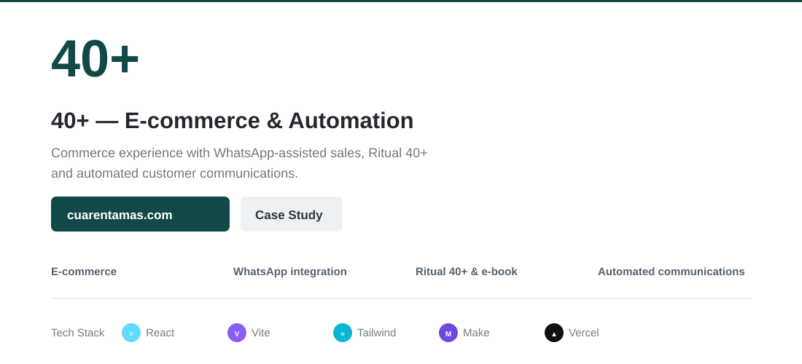

### Architecture
~~~mermaid
flowchart LR
 U[Customer] --> W[React + Vite]
 W --> WA[WhatsApp purchase]
 W --> F[Ritual 40+]
 F --> API[Validation + Turnstile]
 API --> M[Make]
 M --> E[Customer email + e-book]
 M --> I[Internal notification]
 M --> S[Sheets / Drive]
 W -. optional .-> PAY[Payments]
 S -. optional .-> CRM[CRM]
~~~

<strong>Run locally & repository structure</strong>

~~~bash
npm ci
cp .env.example .env
npm run dev
~~~

~~~text
src/        UI, product experience and cart
api/        Secure experience endpoint
server/     Validation
public/     E-book and email assets
docs/       Architecture + sanitized automation docs
~~~

The current purchase flow continues through WhatsApp. Payments and CRM are optional integrations, not current production features.

<strong>Production:</strong> https://cuarentamas.com/

